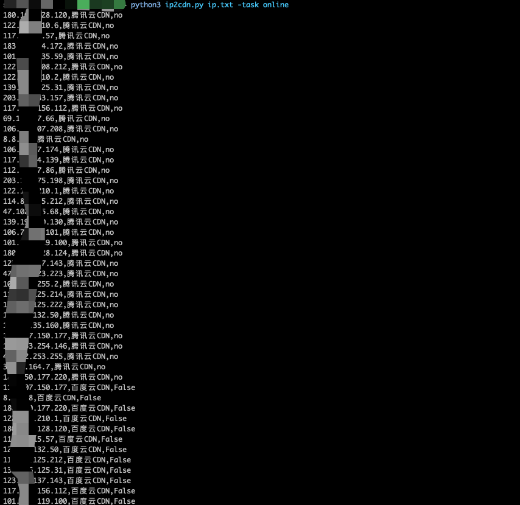

# ip2cdn

> 判断是不是CDN IP，用于收缩目标资产范围。

## :bulb:描述
为什么想做这个?

出发点是因为最近在做黑盒扫描器，没错就是那种简简单单的缝合怪扫描器，但是也丝毫不影响去思考一些有趣的想法。

通过前期信息搜集，我们可以获取到大量的子域名，通过对子域名解析后，A记录会存在大量CDN IP，这部分数据会影响我们后续流程，如端口扫描、WEB服务识别等，会直线影响我们的数据质量，会让我们做很多无用功。所以需要在这些信息搜集大类下去思考一些小而美的点，不断丰富扫描器的功能和效率。

## 功能
- [x] 支持阿里云、腾讯云、百度云、网宿云
- [x] 支持在线和离线两种模式（离线模式主要是我有需求！）

## 如何使用

友情提示:请尽量放低速率！以防出现各种BUG！

将想要识别的IP列表放入文件中，并配置conf.ini中各家API接口AK和SK

```text
pip3 install -r requirements.txt

在线模式
python3 ip2cdn.py ip.txt -task online

离线模式
python3 ip2cdn.py res.txt -task offline
```

## 运行截图



## 思考

做出来在告诉你 :-0，目前算是一个demo版本，自用很舒服

## TODO

其他优化